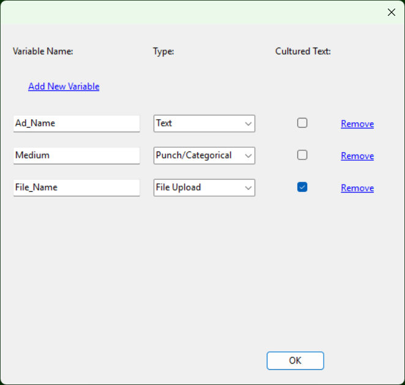

<!DOCTYPE html>
<html>
<head>
<link href="https://cdn.jsdelivr.net/npm/bootstrap@5.3.8/dist/css/bootstrap.min.css" rel="stylesheet" integrity="sha384-sRIl4kxILFvY47J16cr9ZwB07vP4J8+LH7qKQnuqkuIAvNWLzeN8tE5YBujZqJLB" crossorigin="anonymous">

</head>
<body>

    

			

				

					<a href="#" class="d-flex align-items-center mb-3 mb-md-0 me-md-auto text-white text-decoration-none">
						<nowrap>IPSOS Ad Tracker</nowrap>
					</a>
					

					<ul class="nav nav-pills flex-column mb-auto"> 
						<li class="nav-item"> 
							<a href="#Intro" aria-current="page" class="nav-link text-white"> 
								Intro
							</a>
						</li>
						<li>
							<a href="#Variables" class="nav-link text-white"> 
								Variables
							</a>
						</li> 
						<li> 
							<a href="#Manager" class="nav-link text-white"> 
								Manager
							</a> 
						</li> 
						<li> 
							<a href="#Project" class="nav-link text-white"> 
								Project
							</a> 
						</li> 
						<li> 
							<a href="#MenuList" class="nav-link text-white"> 
								List
							</a> 
						</li> 
						<li> 
							<a href="#ListData" class="nav-link text-white"> 
								List Ad Data
							</a> 
						</li> 
					</ul> 
				

			

        

			
<h1>Welcome to IPSOS Ad Tracker Program</h1>

			

			 
			Ad Tracker is a program that allows external updates to live studies to expedite survey changes. Used with X-Track, this shortens the time span in which live changes can be implemented to allow for newly tracked ads.
			 
			 
			
				

				<h4 id="Intro">Intro Menu:</h4>
				 
				

				 
				

				<table class="table table-hover table-bordered table-secondary table-responsive" width="80%">
					<tbody>
						<tr><td class="table-primary title">Load with XML File</td><td class="OptionDetails">Select this option to create a new project as well as any Projects in need of updates from X-Track. The XML file from X-Track is required for all new Projects. If existing files exist on the server, it will attempt to load those. This will also allow you to set up your Project's unique variable structure.Please note that the program will overwrite any data from XML file in favor of those on currently on the Server.</td></tr>
						<tr><td class="table-primary title">Load withOUT XML File</td><td class="OptionDetails">Select this option to open a previously loaded project that do not require an update from X-Track.</td></tr>
						<tr><td class="table-primary title">User Name:</td><td class="OptionDetails">Enter your User Name credentials for the Media Server you are using.</td></tr>
						<tr><td class="table-primary title">Password:</td><td class="OptionDetails">Enter your Password for the Media Server you are using.</td></tr>
						<tr><td class="table-primary title">SID:</td><td class="OptionDetails">Enter the SID of the Project you are working. The program assumes you will be saving files to "[Server Name]/projects/[SID]/"</td></tr>
						<tr><td class="table-primary title">Media Server:</td><td class="OptionDetails">Enter the Media Server you are using. As of now, only the EU Server has been tested so other options, while viable for this tool, will need require an update to the program to use. Do not use the EU Server unless your study's SID is going to be used otherwise the files may be archived or removed.</td></tr>
						<tr><td class="table-primary title">Options:</td><td class="OptionDetails">Available Options:  
							<table class="table mb-0 table-hover table-bordered " width="80%">
								<tr><td class="table-info title">Save password</td><td class="OptionDetails">While the last user's details will be saved, your password will only be saved by the program if this is selected. Only select this option if you are the only user on this PC.</td></tr>
								<tr><td class="table-info title">Update Variables</td><td class="OptionDetails">Selecting this option will open the Variables Menu before loading the project files. This will allow you to add, substract, or edit variables as needed. This is the only way of accessing this menu as it is not available after the project is loaded. This option is selected by default for New Projects. Please note that you must save the Project to Staging in order for the variable changes to be saved.</td></tr>
								<tr><td class="table-info title">Clean local files before loading</td><td class="OptionDetails">This option will remove all existing project files for your local machine prior to downloading the existing files from the server. This option isn't necessary and may result in a slower load time, but will prevent any older files you may have deleted on the Media Server from being reloaded.</td></tr>
							</table>
						</td></tr>
					</tbody>
				</table>
				 
				 
				

				

				<h4 id="Variables">Variable Menu:</h4>
				 
				

				 
				

				<table class="table table-hover table-bordered table-secondary table-responsive" width="80%">
					<tbody>
						<tr><td class="table-primary title">Variable Name:</td><td class="OptionDetails">Name of the DIM (Dimensions) Variable to be loaded. The DIM Functions are designed to look for this variable name. If it does not exist/match, it will not load.</td></tr>
						<tr><td class="table-primary title">Type:</td><td class="OptionDetails">The Type of the Variable to be loaded:  
							<table class="table mb-0 table-hover table-bordered ">
								<tr><td class="table-info title">Text</td><td>A standard DIM string variable. This will allow for any value, including those you may choose to parse within DIM.</td></tr>
								<tr><td class="table-info title">Punch/Categorical</td><td>This will set up the values created as a Categorical value. This includes the option to restrict it to specific values. If that list is not defined (for instance a longer lists) it will accept any value. In all cases, this field will only accept one response. If you need to assign multiple categorical values, you the Text field option and convert that to categorical.</td></tr>
								<tr><td class="table-info title">Number</td><td>A standard DIM numeric variable. This will allow for both long and double values, determined by how the variable within DIM is set up.</td></tr>
								<tr><td class="table-info title">Yes/No</td><td>A standard Boolean (True/False, Yes/No) variable. The values stored will be "True" and "False" to be resolved on the DIM side.</td></tr>
								<tr><td class="table-info title">Date/Time</td><td>A standard Date variable. This can be used insert date or time information in the survey. This will be stored a string in the data, however that string can be converted into a date format within DIM.</td></tr>
								<tr><td class="table-info title">File Upload</td><td>This will allow you to select files to be uploaded and used on to the Media Server. A special File Selection Menu will be accessible for this field.</td></tr>
							</table>
						</td></tr>
						<tr><td class="table-primary">Cultured Text:</td><td class="OptionDetails">"Cultured" variables are those that may change depending the CultureInfo. Ex. A study fielding in en-us and es-us may require different text or image files depending on whether the respondent is taking the survey in English or Spanish. If you only have one language or everyone is seeing the same data you do not need to assign any variables as "Cultured." Each language used will have a unique file generated for use.</td></tr>
					</tbody>
				</table>
				 
				 
				

				

				<h4 id="Manager">Manager Menu:</h4>
				 
				

				 
				

				<table class="table table-hover table-bordered table-secondary table-responsive" width="80%">
					<tbody>
						<tr><td colspan="100%" class="table-primary">File:</td></tr>
						<tr><td>
							<table class="table mb-0 table-hover table-bordered ">
								<tr><td class="table-info title">Export DIM Routing</td><td>This option will export to an ascii txt file the pertinent metadata, routing, and functions specific to your Project's set up. Please note that this is a rough version of it and will highly likely require editing on the Scripter's part. However, it should give you a solid start point to work with. This is intended to be, at most, a one time process for each Project and does not output/save any data.</td></tr>
								<tr><td class="table-info title">Load to Staging</td><td>This will save the data to Staging, including updating a Staging Version in order for you to test on the Staging Server. This set is required prior to Promoting to Production</td></tr>
								<tr><td class="table-info title">Promote to Production</td><td>This will save the data to Production, including updating the Production Version. Please be sure to do a quick test on Production to be sure everything looks okay.</td></tr>
							</table>
						</td></tr>
						<tr><td colspan="100%">&nbsp;</td></tr>
						<tr><td colspan="100%" class="table-primary title">Tools:</td></tr>
						<tr><td>
							<table class="table mb-0 table-hover table-bordered ">
								<tr><td class="table-info title">Set Max Categories</td><td>By default, the maximum number of uniquely coded Ads is 1000. If you plan to start with fewer or require additional values to be used, select this option to update that value. Be sure to Load to Staging in order to save changes here.</td></tr>
								<tr><td class="table-info title">Restore Lists</td><td>If a list is not needed for this Tracker process, you can remove the list from showing within the program. If you need to restore a list, select this option.</td></tr>
								<tr><td class="table-info title">Restore from Backup</td><td>Each unique load to staging or promotion will save back up files. This tool will allow you to store from one of the backs ups, either at a Project-wide level or individual lists/culture infos. This restoration only occurs locally, so be sure to load to staging to save these changes.</td></tr>
							</table>
						</td></tr>
					</tbody>
				</table>
				 
				 
				

				

				<h4 id="Project">Project Menu:</h4>
				 
				

				 
				

				<table class="table table-hover table-bordered table-secondary table-responsive" width="80%">
					<tbody>
						<tr><td class="table-primary title">List Menu</td><td class="OptionDetails">When the X-Track XML is loaded, all lists will be shown within the Menu. Remove any list that is not being specifically used by the Ad Tracker. The rest should be managed through standard X-Track processes.</td></tr>
						<tr><td class="table-primary title">List Ad Data</td><td class="OptionDetails">This is where all data should be entered.</td></tr>
					</tbody>
				</table>
				  
				

				

				<h4 id="MenuList">List Menu:</h4>
				 
				

				 
				

				<table class="table table-hover table-bordered table-secondary table-responsive" width="80%">
					<tbody>
						<tr><td class="table-primary title">List Button</td><td class="OptionDetails">Click on this button show it's associated data.</td></tr>
						<tr><td class="table-primary title">Dropdown Menu:</td><td class="OptionDetails">Click the down arrow to remove the list from the Project.</td></tr>
					</tbody>
				</table>
				  
				

				

				<h4 id="ListData" >List Ad Data:</h4>
				 
				

				 
				

				<table class="table table-hover table-bordered table-secondary table-responsive" width="80%">
					<tbody>
						<tr><td class="table-primary title">Load to Staging</td><td>This will save the data to Staging specific to this list and the selected languages.</td></tr>
						<tr><td class="table-primary title">Promote to Production</td><td>This will save the data to Production specific to this list and the selected languages.</td></tr>
						<tr><td class="table-primary title">Languages:</td><td>This will filter the current data to the only those languages selected. This includes list specific languages selected.</td></tr>
					</tbody>
				</table>
				      
				      
				

	

</body>
</html>